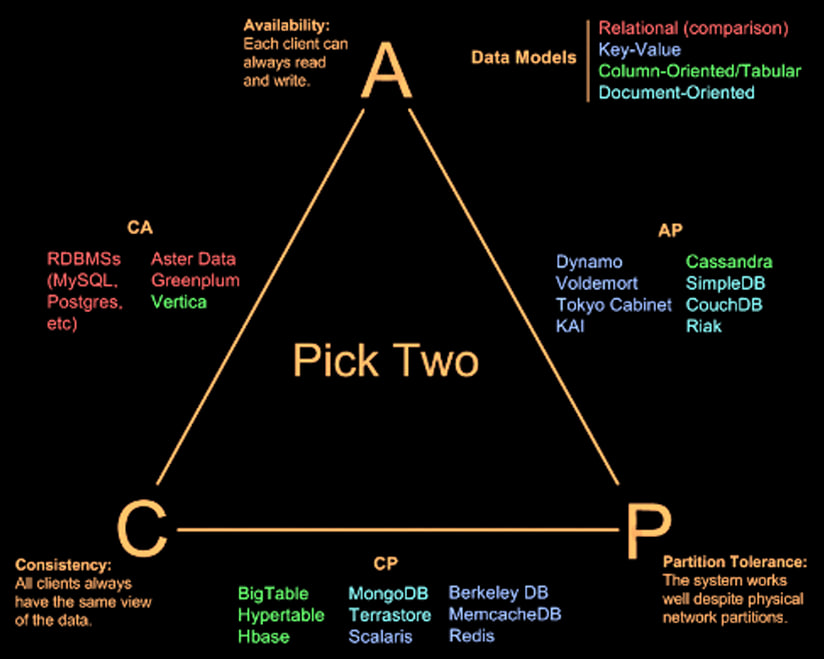

# Summery of Theoretical Concepts. Part 2 (NoSQL Intro)

## 1. NoSQL Intro

### 1.1. Schema

-   **Schema-less or Implicit Schema**: NoSQL databases often operate without a fixed schema, allowing for flexibility in data storage.
-   **Aggregate-based**: Data is stored in aggregates, which are collections of related objects.
-   **Key-value and Document-based**: These models store data as key-value pairs or documents, respectively.
-   **Graph Databases**: These are better suited for relationship-based data compared to relational databases.

### 1.2. Paradigmatic Shift in Big Data

-   **Schema On Write**: Traditional approach where data is structured at the time of writing, which can limit future analysis.
-   **Schema On Read**: Modern approach where data is stored in its raw form and structured only when read, allowing for more flexible analysis.

### 1.3. Logical Architecture of Big Data

-   **Data Ingestion**: Raw data is collected from various sources.
-   **Data Wrangling**: Data is cleaned and transformed.
-   **Big Data Long Term Storage**: Data is stored in formats optimized for querying, such as ORC or Parquet.
-   **Data Views**: Different views of the data are created for various analyses.

### 1.4. Data Lake

-   **Incoming Flow**: Raw data from various sources like emails, spreadsheets, and social media.
-   **Reservoir**: The dataset where analytics are run.
-   **Outflow**: Analyzed data that provides business insights.

### 1.5. Scalability

-   **Vertical Scalability**: Traditional SQL systems scale by adding more resources to a single machine.
-   **Horizontal Scalability**: Big Data solutions scale by adding more machines to the system.

### 1.6. Transactional Properties

-   **ACID Properties**: Atomicity, Consistency, Isolation, and Durability are essential for transactional systems.
-   **Atomicity**: Ensures that a transaction is all-or-nothing.
-   **Consistency**: Ensures that a transaction brings the database from one valid state to another.
-   **Isolation**: Ensures that concurrent transactions do not interfere with each other.
-   **Durability**: Ensures that once a transaction is committed, it remains so.

### 1.7. CAP Theorem

-   **Consistency**: All nodes see the same data at the same time.
-   **Availability**: Every request receives a response about whether it succeeded or failed.
-   **Partition Tolerance**: The system continues to operate despite network failures.
-   **Trade-off**: A distributed system can only guarantee two out of the three properties at the same time.

### 1.8. ACID vs. BASE

-   **ACID**: Focuses on strong consistency and reliability.
-   **BASE**: Focuses on availability and eventual consistency, allowing for more flexibility in distributed systems.

### 1.9. NoSQL Models

-   **Key-Value Store**: Stores data as key-value pairs (e.g., Redis, MemcacheDB).
-   **Column Store**: Stores data in columns rather than rows, useful for analytics (e.g., Cassandra, HBase).
-   **Document Store**: Stores data as documents (e.g., MongoDB, CouchDB).
-   **Graph Store**: Stores data in nodes and edges, ideal for relationship-based data (e.g., Neo4j).

### 1.10. Integration

-   **SQL and NoSQL Integration**: Combining traditional relational databases with NoSQL solutions to leverage the strengths of both.

---

## 2. Neo4j

### 2.1 Motivation

-   **Relational Databases**: While powerful, relational databases are not efficient at managing complex relationships between entities.
-   **Graph Databases**: Designed to handle relationships more naturally, making them ideal for scenarios where relationships are central to the data model.

### 2.2 Graph Databases Overview

-   **Structure**: Graph databases use nodes, edges, and properties to represent and store data.
-   **Index-Free Adjacency**: Each node acts as a pointer to its adjacent nodes, eliminating the need for index lookups.
-   **Edges**: Edges are first-class citizens in graph databases, representing relationships between nodes and often carrying important information.
-   **Properties**: Both nodes and edges can have properties (key-value pairs) that store additional information.

### 2.3 Advantages of Graph Databases

-   **Efficient Relationship Handling**: Graph databases excel at managing and querying highly connected data, such as social networks.
-   **Performance**: They are faster than relational databases for associative data sets because they avoid costly join operations.
-   **Object-Oriented Mapping**: Graph databases map more directly to object-oriented applications, making them easier to use in modern software development.
-   **Flexibility**: They are schema-free, allowing for easy adaptation to changing data models.

### 2.4 Graph Representation vs. Relational Representation

-   **Relational Databases**: Use tables and foreign keys to represent relationships, which can become complex and inefficient for highly connected data.
-   **Graph Databases**: Represent relationships directly through edges, making queries more intuitive and efficient.

### 2.5 Querying in Graph Databases

-   **Graph Matching Approach**: Queries are based on pattern matching, where you specify the patterns of nodes and edges you want to retrieve.
-   **Extensibility**: Graph databases are easy to extend with new nodes, edges, and properties without disrupting existing data.

### 2.6 Neo4J

#### 2.6.1 What is Neo4J?

-   **Overview**: Neo4J is the most popular graph database, developed by Neo Technologies.
-   **Open Source**: It is open-source and implemented in Java, making it accessible to a wide range of developers.
-   **Schema-Free**: Neo4J does not require a predefined schema, allowing for flexible data modeling.
-   **ACID Compliance**: Neo4J ensures atomicity, consistency, isolation, and durability for transactions, making it reliable for operational use.

#### 2.6.2 Neo4J Architecture

-   **Core API**: Provides the fundamental operations for interacting with the graph database.
-   **Transaction Management**: Ensures that all operations are ACID-compliant.
-   **Object Cache**: Improves performance by caching frequently accessed data.
-   **File System Cache**: Enhances read/write performance by caching data at the file system level.
-   **Record Files**: Store the actual graph data on disk.
-   **Transaction Log**: Keeps a log of all transactions for recovery purposes.

#### 2.6.3 Data Model in Neo4J

-   **Nodes**: Represent entities and can have labels (types) and properties.
-   **Edges**: Represent relationships between nodes and can also have properties.
-   **Indexes**: Used to speed up the retrieval of nodes and edges based on specific properties.

#### 2.6.7 Cypher Query Language

-   **Declarative Language**: Cypher is a declarative query language designed specifically for graph databases.
-   **Pattern Matching**: Queries are based on matching patterns of nodes and edges, making it easy to express complex relationships.
-   **Data Creation**: Cypher allows for easy creation of nodes, edges, and properties.
-   **Indexes and Constraints**: Cypher supports the creation of indexes and constraints to optimize queries and ensure data integrity.

#### 2.6.4 Performance Tips

-   **Use Parameters**: Instead of literals, use parameters to allow query reuse and improve performance.
-   **Limit Variable Length Paths**: Always set an upper limit for variable-length patterns to avoid querying the entire graph.
-   **Return Only Necessary Data**: Avoid returning entire nodes or relationships when only specific properties are needed.
-   **Profile and Explain**: Use PROFILE and EXPLAIN to analyze and optimize query performance.

---

## 3 MongoDB

### 3.1. **Sharding**

A key concept in NoSQL databases, which involves partitioning data across multiple servers. It is fully automatic, configurable, and transparent, following the **BASE principles** (Basically Available, Soft state, Eventually consistent).

### 3.2. **Sharding in NoSQL**

-   **Sharding** is used to:
    -   **Scale** applications to handle massive workloads and data volumes.
    -   Support **Geo-Locality** for geographically distributed deployments.
    -   Optimize **hardware performance** and reduce **recovery times**.
-   **Shard Key**: A key defined by the data modeler that partitions data into chunks, which are distributed across multiple servers.

### 3.3. **Document-Oriented Databases**

-   **MongoDB** is a popular document-oriented database that stores data in **JSON-like documents**.
-   **Advantages**:
    -   Handles **schema changes** well.
    -   Solves the **impedance mismatch** problem between object-oriented programming and relational databases.
    -   Supports **dynamic schemas**, making it flexible for agile development.

### 3.4. **MongoDB Overview**

-   **MongoDB** is an open-source, document-oriented database designed for **scalability** and **developer agility**.
-   **Key Features**:
    -   **Rich data model**: Supports complex data structures.
    -   **Full-featured indexes**: Improves query performance.
    -   **Sophisticated query language**: Allows for powerful data retrieval.
    -   **Automatic sharding**: Distributes data across multiple servers.
    -   **Dynamic schema**: Allows for flexible data modeling.

### 3.6. **MongoDB Data Model**

-   **Collections**: A collection in MongoDB is a group of documents.
-   **Documents**: Each document is a JSON-like structure with key-value pairs.
-   **Embedded Documents**: Documents can contain other documents, allowing for nested data structures.
-   **Referenced Documents**: Documents can reference other documents, similar to foreign keys in relational databases.

### 3.7. **Designing NoSQL Data Structures**

-   NoSQL data structures are driven by **application design** and the need for efficient **CRUD operations** (Create, Read, Update, Delete).
-   **Embedding vs. Referencing**:
    -   **Embedding** is preferred when possible, as it reduces the need for joins and improves performance.
    -   **Referencing** is used when data needs to be shared across multiple documents.

### 3.8. **Sharding in MongoDB**

-   **Sharding Strategies**:
    -   **Range Sharding**: Data is partitioned based on a range of values.
    -   **Hash Sharding**: Data is distributed using a hash function.
    -   **Tag Sharding**: Data is assigned to specific shards based on tags.
-   **Auto-Sharding**: MongoDB automatically balances data across shards and migrates data when necessary.

### **Comparison**

| **Strategy**  | **Strengths**                                                        | **Weaknesses**                                                 |
| ------------- | -------------------------------------------------------------------- | -------------------------------------------------------------- |
| **Ranged**    | Efficient for range queries.                                         | Can lead to unbalanced data distribution with skewed datasets. |
| **Hashed**    | Ensures even data distribution across shards.                        | Inefficient for range-based queries.                           |
| **Tag-Aware** | Supports custom distribution based on logical or geographical needs. | Complex to plan and manage; may result in uneven shard usage.  |

### 3.9. **CAP Theorem and MongoDB**

-   MongoDB focuses on **Consistency** and **Partition Tolerance** (CP).
-   **Consistency**: All replicas contain the same version of the data.
-   **Partition Tolerance**: The system remains operational even if network partitions occur.

### 3.11 **MongoDB Processes**

-   **Mongod**: The main database process that handles data storage and retrieval.
-   **Mongos**: A sharding router that directs queries to the appropriate shards.
-   **Mongo Shell**: An interactive JavaScript shell for interacting with MongoDB.
